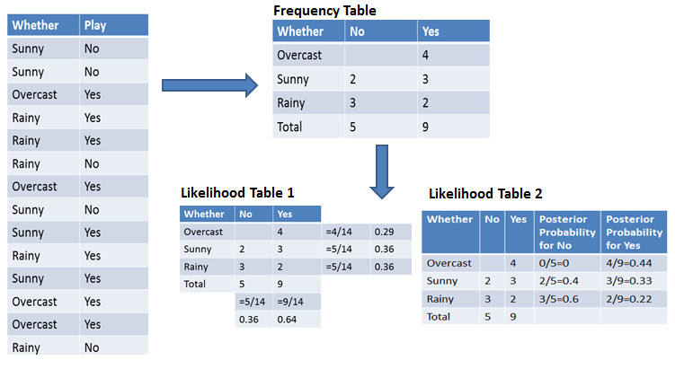

<head>

</head>

 Analysing Charlie and the Chocolate Factory 🍫 

- [1. Frequently used terms](#1-frequently-used-terms)
- [2. Packages (we love packages in Python!)](#2-packages-we-love-packages-in-python)
  - [2.1. Pulling data](#21-pulling-data)
  - [2.2. Storing data](#22-storing-data)
  - [2.3. Linguistic tools](#23-linguistic-tools)
  - [2.4. Mathematical tools](#24-mathematical-tools)
- [3. Extensions](#3-extensions)
  - [3.1. TD-IDF or Term Frequency Inverse Data Frequency](#31-td-idf-or-term-frequency-inverse-data-frequency)
  - [3.2. Text normalisation: Stemming and lemmatisation](#32-text-normalisation-stemming-and-lemmatisation)
    - [3.2.1. Stemming](#321-stemming)
    - [3.2.2. Lematisation](#322-lematisation)
  - [3.3. spaCy](#33-spacy)
  - [3.4. Naive Bayes Classification using scikit-learn](#34-naive-bayes-classification-using-scikit-learn)
  - [3.5. More ideas!](#35-more-ideas)
- [4. Outlook](#4-outlook)
- [5. References](#5-references)
  
This project is based on the "Natural Language Processing in Python Tutorial" given by PyOhio. I really don't have any experience with any field in data science, let alone natural language processing (or let alone Python lol). The concepts covered in the tutorial were quite new and interesting to me, so I decided to conduct a project on my own and to further dive into some concepts proposed in the tutorial. 

# 1. Frequently used terms

> **(Written) Corpus**: a large map of texts. For example, mapping from an author (key) to his transcript. (value)

> **Document Term Matrix**: Word counts in a matrix (also a map), where columns are words and rows are documents (for example different books from different authors). Sometimes referred as term-document matrix as well, which is a transposed form of the DTM.

> **Stop-words:** Words which do not necessarily contain information of important significance to NLP. They are often words like (like, as, be, the, this etc.)

> Stems/ Roots/ Lemmas

# 2. Packages (we love packages in Python!)

## 2.1. Pulling data
1. bs4 (Beautiful soup) - parses data from HTML and XMLs; probably only useful if I'm scraping information from sites.
2. requests - for pulling data from sites; not useful at the moment.

## 2.2. Storing data
1. pickle - keep python objects in an actual file (`.pkl`) for further use.
2. pandas - data frames or databases for storing data.
3. defaultdics in collections - easier for processing maps of data

## 2.3. Linguistic tools
1. `gensim` (matutils and models) - topic modelling by taking a corpus and a number of topics
2. TextBlob in `textblob` - for determining sentiment and polarity of words within a text.
3. `nltk` (or Natural Language Toolkit) - a powerful tool developed by linguists at UPenn, it tags words with categories (nonun, adjectives and much more), and allows tokenization of long strings.
4. sklearn.feature_extraction (`text` and `countvectoriser`) - used for converting the data to a document term matrix, and various options for filtering actually "useful" words or phrases.
5. `re` - great for recognising common text expressions.
6. `strings` - for manipulating string objects
7. WorldCloud in `wordcloud` - for generating topical wordclouds.
8. `random` - for random text generation (sort of allows you to create an infinite map/ web)

## 2.4. Mathematical tools
1.  `matplotlib` - for plotting graphs!
2.  `numpy` - offers other types of plots like bar plots, and even subplots.
3.  `math` - duh!
4.  `seaborn` (based on matplotlib) - a more highlevel interface for drawing attractive and informative statistical graphs. Support for examining relationships, categorial variables, univariate or vibariate distributions, regression, multiplot grids, more options for visualisation and appearance.
5.  `plotly.py` - beautiful charts, licensed by MIT.
6.  `bokeh` - GUI for creating highly customed or specialised plots

# 3. Extensions

## 3.1. TD-IDF or Term Frequency Inverse Data Frequency
- Term frequency (tf): frequency of word ( in each document) in the corpus. Ratio of term frequency to total word count.  
  $tf_{i,j} = \frac{n_{i,j}}{\sum_{k} n_{i,j}}$
- Inverse Data Frequency (idf):  used to calculate the weight of rare words across (all documents in) the corpus. Words that rarely occur in the corpus have a high IDF score.  
$idf(w) = log(\frac{N}{df_t})$
- TF-IDF is the product of tf and idf:  
$w_{i,j} = tf_{i,j} \times idf(w)$

- Notation
  - $tf_{i,j}$ = number of occurences of i in j
  - $df_i$ = number of documents containing i
  - N = total number of documents

> Implementation suggestion: `TfidFVectorizer` from `sklearn.feature_extraction.text`.

## 3.2. Text normalisation: Stemming and lemmatisation

When a language contains words that are derived from another (root) word , the changes are called **Inflected Language**. For example, modifications are made to reflect tense, case, aspect, person, number, gender and mood or position in speech. For example, googling fish (I use DuckDuckGo) will also result in fishes, fishing as fish is the stem of both words.

Stemming and lemmatisation both helps us to achieve or obtain the root form of inflected words, but their approach in obtaining the root forms of words are different.

For English, there are 2 different stemmers available for `nltk`, including  PorterStammer or LancasterStammer.

### 3.2.1. Stemming
> Stemming is the process of reducing inflection in words to their root forms such as mapping a group of words to the same stem even if the stem itself is not a valid word in the Language.

Stem (or root) is the part of the word to which you add inflectional affixes such as (-ed,-ize, -s,-de,mis). So stemming a word may result in words that do not exist. Stems are created by removing the inflections used with a word.

    Word                Porter Stemmer      Lancaster Stemmer   
    friend              friend              friend              
    friendship          friendship          friend              
    friends             friend              friend              
    friendships         friendship          friend              
    stabil              stabil              stabl               
    destabilize         destabil            dest                
    misunderstanding    misunderstand       misunderstand       
    railroad            railroad            railroad            
    moonlight           moonlight           moonlight           
    football            footbal             footbal   

In gneral, PortStemmer is simpler and faster as it applies a fixed set og rules in phases to generate stems. `SnowballStemmers` can bs used to create non-English stemmers. In comparison, the LancasterStemmer applies an iterative algorithm, by saving  the last character of the word and applying changes according to 120 rules; it is prone to over-stemming, and may lead to stem words that are not linguistically correct.

### 3.2.2. Lematisation

> Lemmatization reduces the inflected words properly, ensuring that the root word belongs to the language. In Lemmatization the root word is called a Lemma. A lemma (plural lemmas or lemmata) is the canonical form, dictionary form, or citation form of a set of words.

You need to provide the context in which you want to lemmatize, that is the parts-of-speech (verb, noun, adjective......). This is done by giving the value for pos parameter in `wordnet_lemmatizer.lemmatize`.

    for word in sentence_words:
        print ("{0:20}{1:20}".format(word,wordnet_lemmatizer.lemmatize(word, pos="v")))

    # Results
    He                  He                  
    was                 be                  
    running             run                 
    and                 and                 
    eating              eat                 
    at                  at                  
    same                same                
    time                time                
    He                  He                  
    has                 have                
    bad                 bad                 
    habit               habit               
    of                  of                  
    swimming            swim                
    after               after               
    playing             play                
    long                long                
    hours               hours               
    in                  in                  
    the                 the                 
    Sun                 Sun                 

**Useful tools in nltk**
- Stemmers: PortStemmer and LancasterStemmer
- Tokenize words
- Tagging words with part of speech.
- Check out NLTK Text Corpora for free corpuses derived from e-books, web and news documents, by `nltk.download()`
- Stop-words removal (and union your own list of stop-words)

## 3.3. spaCy
spaCy offers various "industrial-strength" features for natural language processing Python:
- Non-destructive tokenization, sentence segmentation
- Named entity recoognition and entity linking
- Statistical models and pretrained word vectors
- Tag with parts of speech
- Labelled dependency parsing: extracting a dependency parse of a sentence that represents its grammatical structure and defines the relationships between “head” words and words, which modify those heads. For example, identifying the subjects, conjucatons, modifications, case, determinant
- Neural networking
- Word vectors - provide information about definitions of words; available in a lookup table, and each word only has one representation regardless of context
- Language model pretraining - contextualised word representations- `spacy pretrain` trains a language model to predict each word's word vector based on surrounding words.
  - Rule based training
  - Bootstrap first set of training example texts
  - Train with annotations 
- (Most importantly), integration with deep learning.

## 3.4. Naive Bayes Classification using scikit-learn

Naive Bayes is a statistical classification one of the simplest supervised learning algorithms. It is  fast, accurate and reliable for large datasets.

> It assumes that the effect of a particular feature in a class is independent of other features. 

For example, a loan applicant is desirable or not depending on his/her income, previous loan and transaction history, age, and location. Even if these features are interdependent, these features are still considered independently. This assumption simplifies computation, and that's why it is considered as **naive**. This assumption is called **class conditional independence**.

$P(h|D) = \frac{P(D|h) \times P(h)}{P(D)}$  

Notation:
- P(h) = probability of hypothesis being true regardless of the data) - A.K.A. prior probability of h.
- P(D) = probability of the data (regardless of the hypothesis)
- P(h|D) = probability of hypothesis h given the data D - A.K.A. posterior probability.
- P(D|h) = the probability of data d given that the hypothesis h was true - A.K.A. posterior probability.

**Steps**  
Step 1: Calculate the prior probability for given class labels  
Step 2: Find Likelihood probability with each attribute for each class  
Step 3: Put these value in Bayes Formula and calculate posterior probability.  
Step 4: See which class has a higher probability, given the input belongs to the higher probability class.  

> Implementation: `from sklearn.naive_bayes import GaussianNB`

**Disadvantages**
- Assumption of independent features (its almost impossible)
- Zwero posterior probability

## 3.5. More ideas!
- Text mining: text categorization, text clustering, concept/entity extraction, production of granular taxonomies, sentiment analysis, document summarization, and entity relation modeling (i.e., learning relations between named entities
- Query Expansion in Information Retrieval (IR) Environments
- Document clustering: normally performed after techniques including tokenization, stemming and lemmatisation, removing stop words (and punctuation), tf-idf
- Latent Semantix Indexing: "adding contextually-relevant/ thematically-related keywords or synonyms" by analysing relationships between two documents and terms they contain, to create a matrix out of large text. This is how Google predicts what your further searches will be.
- Non-negative matrix factorisation
- LSTM (Long Short-Term Memory) and Deep Learning

# 4. Outlook
1. Data cleaning: 
    - Data cleaning helps avoid "garbage in , garbage out" -- we do not want to feed meaningless data into a model which will probably return us with more meaningless junk.
    - This time I will skip the scraping part that data scientists normally do. This allows the content to be updated over time, but to be fair the content is pretty static anyways so I don't really see the point of doing so. In addition, I imagine there would be quite a number of problems if the layout of the site changes.
    - Input: a simple text file with metadata removed. Headers and page numbers are kept though.
    - Text pre-processing techniques: 

# 5. References
1. [More on TF-IDF](https://www.freecodecamp.org/news/how-to-process-textual-data-using-tf-idf-in-python-cd2bbc0a94a3/)
2. [Stemming and Lemmatization via NLTK](https://www.datacamp.com/community/tutorials/stemming-lemmatization-python)
3. [Spacy Tutorial](https://course.spacy.io/en/)
4. [Naive Bayes Classification](https://www.datacamp.com/community/tutorials/naive-bayes-scikit-learn)
5. [Introduction to Deep Learning](https://campus.datacamp.com/courses/introduction-to-deep-learning-in-python/basics-of-deep-learning-and-neural-networks?ex=1)